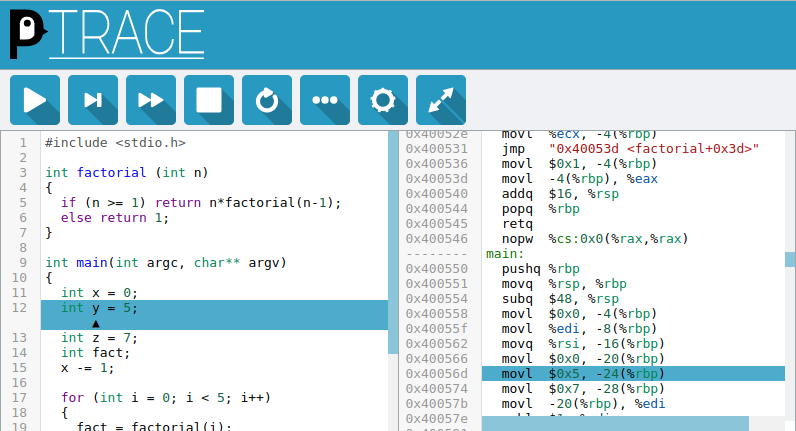

# penguinTrace

## Introduction

penguinTrace is intended to help build an understanding of how programs run at the hardware level. It provides a way to see what instructions compile to, and then step through those instructions and see how they affect machine state as well as how this maps back to variables in the original program.

penguinTrace starts a web-server which provides a web interface to edit and run code. Code can be developed in C, C++ or Assembly. The resulting assembly is then displayed and can then be stepped through, with the values of hardware registers and variables in the current scope shown.

penguinTrace runs on Linux and supports the AMD64/X86-64 and AArch64 architectures. penguinTrace can run on other operating systems using Docker, a virtual machine or through the Windows Subsystem for Linux (WSL).



The primary goal of penguinTrace is to allow exploring how programs execute on a processor, however the development provided an opportunity to explore how debuggers work and some lower-level details of interaction with the kernel.

**Note:** penguinTrace allows running arbitrary code as part of its design. By default it will only listen for connections from the local machine. It should only be configured to listen for remote connections on a trusted network and not exposed to the interface. This can be mitigated by running penguinTrace in a container, and a limited degree of isolation of stepped code can be provided when ```libcap``` is available.

## Getting Started

### Prerequisites

penguinTrace requires 64-bit Linux running on a X86-64 or AArch64 processor. It can also run on a Raspberry Pi running a 64-bit (AArch64) Linux distribution. For other operating systems, it can be run on Windows 10 using the Windows Subsystem for Linux (WSL) or in a Docker container. WSL does not support tracee process isolation.

```
python
clang
llvm
llvm-dev
libclang-dev
libcap-dev # For containment
```

### Building

To build penguinTrace outside of a container, clone the repository and run ```make```. The binaries will be placed in ```build/bin``` by default.

To build penguinTrace in Docker, run ```docker build -t penguintrace github.com/penguintrace/penguintrace```.

### Running

Once penguinTrace is built, running the ```penguintrace``` binary will start the server.

If built in a container it can then be run with ```docker run -it -p 8080:8080 --tmpfs /tmp:exec --cap-add=SYS_PTRACE --cap-add=SYS_ADMIN --rm --security-opt apparmor=unconfined penguintrace penguintrace```. See [Containers](#containers) for details on better isolating the container.

Then navigate to [127.0.0.1:8080](http://127.0.0.1:8080) or [localhost:8080](http://localhost:8080) to access the web interface.

#### Temporary Files

The penguinTrace server uses the system temporary directory as a location for compiled binaries and environments for running traced processes. If the ```PENGUINTRACE_TMPDIR``` environment variable is defined, this directory will be used. It will fall back to the ```TMPDIR``` environment variable and finally the directories specified in the C library.

This must correspond to a directory without ```noexec``` set, if running in a container it is likely the filesystem will have this set by default.

#### Networking

By default penguinTrace only listens on the loopback device and IPv4. If the server is configured to listen on all addresses, then also setting the server to IPv6 will allow connections on both IPv4 and IPv6, this is the default mode when running in a Docker container.

This is because penguinTrace only creates a single thread to listen to connections and so can currently only bind to a single address or all addresses.

#### Session Handling

By default penguinTrace runs in multiple session mode, each time code is compiled a new session is created. The URL fragment (after the '#') of the UI is updated with the session id, and this URL can be used to reconnect to the same session.

If running in single session mode each penguinTrace instance only supports a single debugging instance. The web UI will automatically reconnect to a previous session. To support multiple sessions, multiple instances should be launched which are listening on different ports.

#### Containers

The ```docker_build.sh``` and ```docker_run.sh``` scripts provide an example of how to run penguinTrace in a Docker container. ```Dockerfile_noisolate``` provides an alterative way of running that does not require the ```SYS_ADMIN``` capability but provides less isolation between the server and the traced processes. The ```SYS_PTRACE``` capability is always required for the server to trace processes. ```misc/apparmor-profile``` provides an example AppArmor profile that is suitable for running penguinTrace but may need some customisation for the location of temporary directories and compilers.

### AArch64 / Raspberry Pi

penguinTrace will only run under a 64-bit operating system. The official operating systems provided for the Raspberry Pi are all 32-bit, to run penguinTrace something such as [pi64](https://github.com/bamarni/pi64) or [Arch Linux Arm](https://archlinuxarm.org/platforms/armv8/broadcom/raspberry-pi-3) is required.

Full instructions for setting up a 64-bit OS on Raspberry Pi TBD.

## Authors

penguinTrace is developed by [Alex Beharrell](https://github.com/martiansoup).

## License

This project is licensed under the GNU AGPL. A non-permissive open source license is chosen as the intention of this project is educational, and so any derivative works should have the source available so that people can learn from it.

The bundling of the source code relies on the structure of the repository. Derivative works that are not forked from a penguinTrace repository will need to modify the Makefile rules for ```static/source.tar.gz``` to ensure the modified source is correctly distributed.

## Acknowledgements

penguinTrace makes use of [jQuery](https://jquery.com) and [CodeMirror](https://codemirror.net) for some aspects of the web interface. Both are licensed under the MIT License. It also uses the [Major Mono](http://www.emreparlak.com/major/) font which is licensed under the Open Font License.

